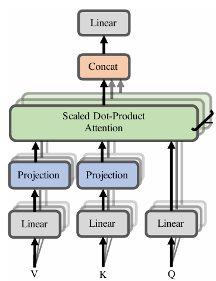
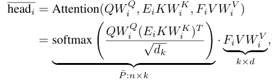
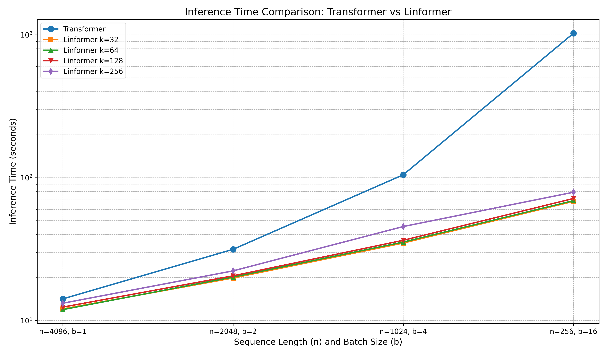
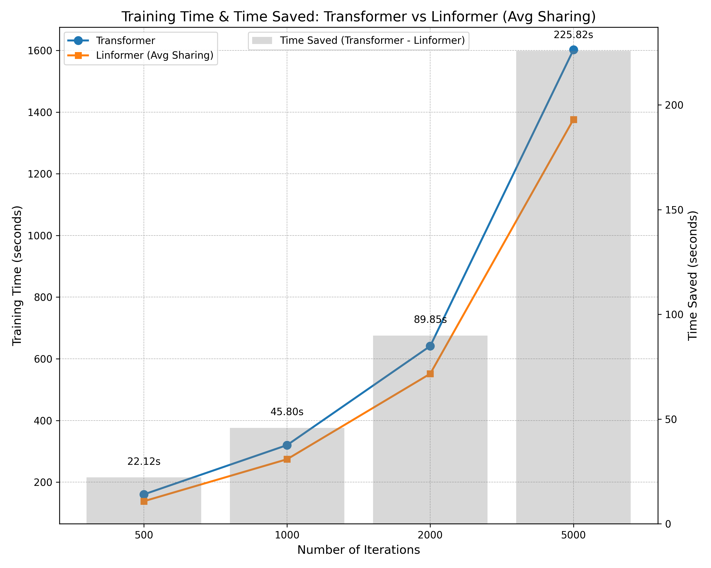

# Linformer – A Practical Way to Scale Transformers Efficiently

This repository provides a clean implementation of the [Linformer](https://arxiv.org/abs/2006.04768) model — a variant of the Transformer architecture that reduces the complexity of self-attention from $\mathcal{O}(n^2)$ to $\mathcal{O}(n)$, enabling more efficient processing of longer sequences.

All code is contained in a single Jupyter Notebook.

---

## 📓 Project Contents

- ✅ Linformer model implementation  
- ✅ Modular training pipeline  
- ✅ Empirical studies and comparisons with standard Transformers

---

## 📘 Main Notebook

The complete Linformer implementation is available in the following notebook:

📂 [`linformer.ipynb`](linformer.ipynb)

This notebook includes:
- The full model code, including low-rank projection logic
- Tokenization and data handling
- Training loop with learning rate scheduling
- Visualization and analysis tools

You can run this notebook end-to-end or modify it for your own experiments.

---

## 🧠 Model Architecture

- Linformer replaces standard self-attention with a **projected attention mechanism**, where the key and value matrices are linearly projected to a lower dimension.
- This reduces self-attention complexity from $\mathcal{O}(n^2)$ to $\mathcal{O}(n)$.
- The model remains fully compatible with the standard Transformer architecture, ensuring ease of integration into existing pipelines.
- Linformer supports parameter sharing at different granularities:
  - `headwise`
  - `key-value`
  - `layerwise`  
These progressively reduce the number of projection matrices from 24 → 12 → 1 in a 12-layer, 12-head configuration.

---

## ⚙️ How It Works

  

- Linformer introduces **linear self-attention** by projecting the key and value matrices using low-rank matrices $E_i$ and $F_i$, reducing their shape from $n \times d$ to $k \times d$.
- This reduces the complexity from $\mathcal{O}(n^2)$ to $\mathcal{O}(nk)$, providing a significant efficiency gain when $k \ll n$.

---

## 🛠️ Training Pipeline

The training pipeline is designed to be efficient, modular, and reproducible. Key components include:

1. **Library Imports**  
   Utilizes essential libraries like PyTorch for model definition and training.

2. **Tokenization**  
   Inputs are tokenized using the GPT-2-compatible [Tiktoken](https://github.com/openai/tiktoken) tokenizer.

3. **Data Splitting**  
   The dataset is divided into training and validation sets for performance monitoring.

4. **Model Configuration**  
   A centralized config object defines model hyperparameters:  
   number of layers, attention heads, embedding size, sequence length, and dropout rate.

5. **Model Components**  
   Modular components include:
   - Token & positional embeddings  
   - Linear attention with low-rank projections  
   - Feedforward layers  
   - Transformer blocks with residual connections and LayerNorm

6. **Model Assembly**  
   The full Linformer is assembled by stacking Transformer blocks and appending a final linear head.

7. **Learning Rate Scheduler**  
   A scheduler is used to stabilize training:
   - **Warm-up phase:** Gradually increases the learning rate during the initial 5% of steps  
   - **Cosine decay:** Smoothly decays the learning rate thereafter

---

## 📊 Studies and Experiments

This section summarizes empirical evaluations comparing Linformer with standard Transformers.

### 1. Inference Time Reduction  
Linformer consistently achieves faster inference times as sequence length increases.  
- Benchmarked on generating 1000 tokens across varying batch sizes and sequence lengths (starting at batch size = 1 and context length = 4096).  
- Embedding dimension was 512.  
- Linformer was evaluated for projection sizes $k = 32, 64, 128, 256$.

---

### 2. Training Time Reduction  
Linformer shows faster training convergence compared to the standard Transformer, especially at higher sequence lengths.  
- The reduced complexity allows for quicker backpropagation and lower computation overhead.

---

### 3. Memory Efficiency  
Linformer significantly alleviates memory bottlenecks.  
- On a 16GB GPU:
  - **Transformer:** Maxed out at context length = 4096 and embedding dim = 1024  
  - **Linformer (k = 32):** Successfully trained at context length = 4096 and embedding dim = 2048  
  - Batch size was kept at 1 for fair comparison

This highlights Linformer’s scalability under constrained memory environments.

---

## 📚 Reference

- Wang et al., [**Linformer: Self-Attention with Linear Complexity**](https://arxiv.org/abs/2006.04768), *arXiv:2006.04768*

---
