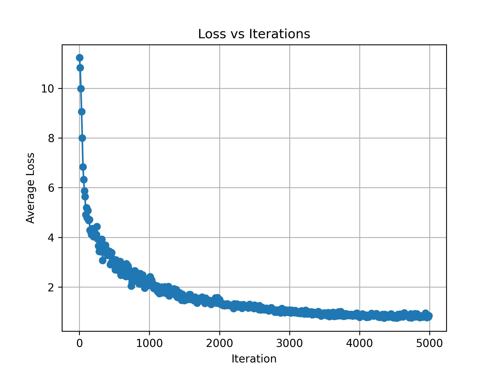

# Linformer – A Practical Way to Scale Transformers Efficiently

This repository contains an implementation of the Linformer model, a variant of the Transformer architecture that reduces the complexity of self-attention from O(n²) to O(n), making it more efficient for longer sequences.

All code is provided in a single Jupyter Notebook and includes training, inference, and ablation experiments comparing Linformer with standard Transformer models.

---

## 📓 Project Contents

- ✅ Linformer model implementation  
- ✅ Training pipeline and inference code  
- ✅ Loss curve
- ✅ Studies and Experiments

---

## Model Architecture

- Linformer replaces the full self-attention with projected key and value matrices, reducing the attention complexity from $O(n^2)$ to $O(n)$.
- The model architecture remains compatible with the standard Transformer pipeline, allowing seamless integration into existing frameworks while enabling faster training and inference on long sequences.
- Parameter sharing in Linformer can be done at three levels : `headwise` `key-value` `layerwise` progressively reducing the number of distinct projection matrices from 24 to 12 to 1 in a 12-layer, 12-head model.

---

## How it works?

  

- Linformer introduces a linear self-attention mechanism by projecting the key and value matrices using low-rank linear projections Eᵢ and Fᵢ, reducing their shape from n × d to k × d.
- This reduces the attention complexity from O(n²) to O(nk), making it much more efficient when k ≪ n.

---

# Linformer – A Practical Way to Scale Transformers Efficiently

This repository contains an implementation of the Linformer model, a variant of the Transformer architecture that reduces the complexity of self-attention from O(n²) to O(n), making it more efficient for longer sequences.

All code is provided in a single Jupyter Notebook and includes training, inference, and ablation experiments comparing Linformer with standard Transformer models.

---

## 📓 Project Contents

- ✅ Linformer model implementation  
- ✅ Training pipeline and inference code  
- ✅ Loss curves and performance visualizations  
- ✅ Ablation studies: training & inference time comparison  

---

## Model Architecture

- Linformer replaces the full self-attention with projected key and value matrices, reducing the attention complexity from $O(n^2)$ to $O(n)$.
- The model architecture remains compatible with the standard Transformer pipeline, allowing seamless integration into existing frameworks while enabling faster training and inference on long sequences.

---

## How it works?

  

- Linformer introduces a linear self-attention mechanism by projecting the key and value matrices using low-rank linear projections Eᵢ and Fᵢ, reducing their shape from n × d to k × d.
- This reduces the attention complexity from O(n²) to O(nk), making it much more efficient when k << n.

---

## 🛠️ Training Pipeline

The training process for the Linformer model is structured to be efficient, modular, and reproducible. Below is a high-level overview of the key stages in the pipeline:

1. **Library Imports**  
   Essential libraries like PyTorch, `torch.nn.functional`, etc., are loaded to support model development.

2. **Tokenization**  
   Input data is tokenized using the GPT-2-compatible [Tiktoken](https://github.com/openai/tiktoken) tokenizer.

3. **Data Splitting**  
   The tokenized dataset is split into training and validation sets to monitor generalization performance during training.

4. **Model Configuration**  
   A config object defines key hyperparameters such as layers, heads, hidden dimensions, sequence length, and dropout.

5. **Model Components**  
   Core Linformer modules include:
   - Token & positional embeddings  
   - Linear self-attention with low-rank projections  
   - Feedforward layers  
   - Transformer blocks with residuals and LayerNorm

6. **Model Definition**  
   The full Linformer model is instantiated by stacking the necessary number of Transformer blocks and adding a final linear head for prediction.

7. **Learning Rate Scheduler**  
   A learning rate scheduler is used to stabilize and accelerate training:
   - **Warm-up phase:** Gradually increases the learning rate for the first 5% of total training iterations  
   - **Cosine decay:** Smoothly decays the learning rate following a cosine schedule for the remaining steps

This modular and well-structured pipeline ensures clarity, ease of experimentation, and efficient training on long sequences.

---

## 📉 Loss v/s Iterations Curve

---

## 📊 Studies and Experiments

This section highlights key outcomes from ablation studies comparing Linformer and standard Transformer architectures.

### 1. Inference Time Reduction  
Linformer consistently achieves faster inference than standard Transformers.  
- As the number of iterations increases, the time gap widens in Linformer’s favor.  
- Evaluation was based on generating 1000 tokens across different batch sizes and context lengths (starting at batch size = 1 and context length = 4096).  
- The embedding dimension was 512, and Linformer was tested for k = 32, 64, 128, and 256.

**Inference Time Plot**  

---

### 2. Training Time Reduction  
Training time also decreased with Linformer, showing trends similar to inference.  
- The model benefits from reduced attention complexity, resulting in faster training on long sequences.

** Training Time Plot**  

---

### 3. Memory Efficiency & Bottleneck Relief  
Linformer alleviates memory bottlenecks seen in standard Transformers.  
- On a 16GB GPU:
  - **Transformer:** Maxed out at context length 4096 and embedding dim = 1024  
  - **Linformer (k = 32):** Managed context length 4096 with embedding dim = 2048  
  - Both used batch size = 1

This demonstrates Linformer’s improved scalability under memory constraints.

---
